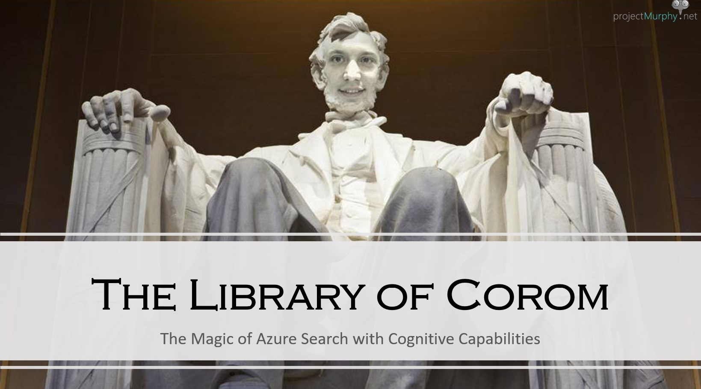
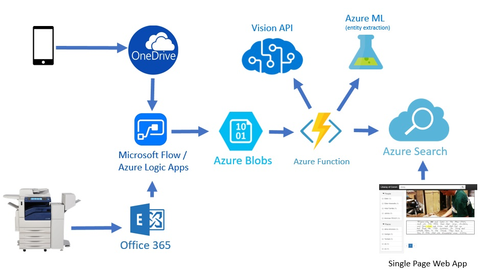

# The Library Of Corom
Build cognitive enriched searchable libraries in Azure for all your treasures.

You can watch the demo in action in [Joseph Sirosh Build 2017 session (@5:00)](https://channel9.msdn.com/Events/Build/2017/B8081)

## Overview
This project can be used to easily create an data enrichment pipeline that allows you to
index documents and images automaticaly from your phone, email, scanner, etc. and search
them using a Web UI.  The search index is enriched using Microsoft cognitive cabilities
which currently include:
* Handwriting / OCR (keyword search)
* Named Entity extraction (People and Places)
* Image caption and Tags
* Adult / Racy image score

### Services

The data pipeline is as follows:
1. images are captured on devices (such as a phone, scanner, etc)
2. images are uploaded to the cloud (such as OneDrive, or Office 365, Outlook.com, etc)
3. [Microsoft Flow](http://flow.microsoft.com/) (or [Azure Logic Apps](https://azure.microsoft.com/en-us/services/logic-apps/)) is configured to automatically move images from various places to [Azure blob storage](https://azure.microsoft.com/en-us/services/storage/blobs/)
4. An [Azure Function](https://azure.microsoft.com/en-us/services/functions/) triggered by the blog store and
    a. uses the [Cognitive Services Vision API](https://azure.microsoft.com/en-us/services/cognitive-services/computer-vision/) extract text information from the image
    b. and an [Azure ML webservice to extract named entities](https://gallery.cortanaintelligence.com/Experiment/Entity-Recognition-Web-Service-2) from the text (People and Places)
    c. then adds the data to the [Azure Search](https://azure.microsoft.com/en-us/services/search/) index
5. A single page Web App uses the [AzSearch.js library](https://github.com/EvanBoyle/AzSearch.js) to search to index

### Limitations
1. This is just a demo to showcase a congnitive search scenario.  It is not intended to demonstrate a scalable architecture.
2. The OCR technology is not perfect and the handwriting capability is in preview.  The results will vary greatly by scan and image quality.
2. It only processes images. Documents need to be in image format (.jpg, .png, etc) rather than PDF or other document formats.
   Scanned documents with multiple pages should be in **multi-page TIFF** format.  Check your scanner to see if it will generate this.

### Setting up your own library
Additional Instruction on how to setup you own library are comming soon!

[Visual Studio 2015 tools for Azure Functions](https://blogs.msdn.microsoft.com/webdev/2016/12/01/visual-studio-tools-for-azure-functions/)